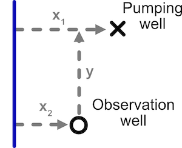

<!-- README.md is generated from README.Rmd. Please edit that file -->

# isw

<!-- badges: start -->
<!-- badges: end -->

The goal of isw is to enable modeling of stream depletion and aquifer
drawdown.

## Installation

You can install the development version of isw from
[GitHub](https://github.com/) with:

``` r
# install.packages("remotes")
remotes::install_github("gopalpenny/isw")
```

## Example

This is a basic example which shows you how to solve a common problem:

``` r
library(isw)
#> Loading required package: expint
```

Consider the following configuration of stream, pumping well, and
observation well.



Stream depletion and aquifer drawdown in this scenario can be modeled
using the function `get_depletion_from_pumping` in this package.

``` r
library(units)
x1 <- set_units(c(1, 5, 10) * 1e3, "ft")
x2 <- set_units(1e3, "ft")
y <- set_units(1e3, "ft")
D <- set_units(100, "ft")
K <- set_units(0.001, "ft/sec")
t <- set_units(5, "year")
V <- 0.2 # unitless
get_depletion_from_pumping(x1 = x1, x2 = x2, y = y, K = K, D = D, V = V, t = t)
#> Warning in get_aquifer_drawdown_ratio(r = r_w, K = K, D = D, V = V, t = t): ADD
#> CHECK THAT ALPHA IS A UNITS OBJECT
#> Warning in get_aquifer_drawdown_ratio(r = r_wi, K = K, D = D, V = V, t = t):
#> ADD CHECK THAT ALPHA IS A UNITS OBJECT
#>   stream_depletion_fraction aquifer_drawdown_ratio
#> 1                 0.9365474    -1.2707109 [s/ft^2]
#> 2                 0.6905933    -0.5705381 [s/ft^2]
#> 3                 0.4259739    -0.2299550 [s/ft^2]
```

The variables can also be specified as named columns of a `data.frame`
or `tibble`. While either can be used, `tibble` package is used below
because it works more seamlessly with `units` objects.

``` r
library(tibble)
df <- tibble(x1 = x1, x2 = x2, y = y, K = K, D = D, V = V, t = t)
get_depletion_from_pumping(df)
#> Warning in get_aquifer_drawdown_ratio(r = r_w, K = K, D = D, V = V, t = t): ADD
#> CHECK THAT ALPHA IS A UNITS OBJECT
#> Warning in get_aquifer_drawdown_ratio(r = r_wi, K = K, D = D, V = V, t = t):
#> ADD CHECK THAT ALPHA IS A UNITS OBJECT
#>   stream_depletion_fraction aquifer_drawdown_ratio
#> 1                 0.9365474    -1.2707109 [s/ft^2]
#> 2                 0.6905933    -0.5705381 [s/ft^2]
#> 3                 0.4259739    -0.2299550 [s/ft^2]
```

For details of this function, check `?get_depletion_from_pumping`.

## Website

You can find further information about this package, including function
help files and tutorials on the [package
website](https://gopalpenny.github.io/isw/).
